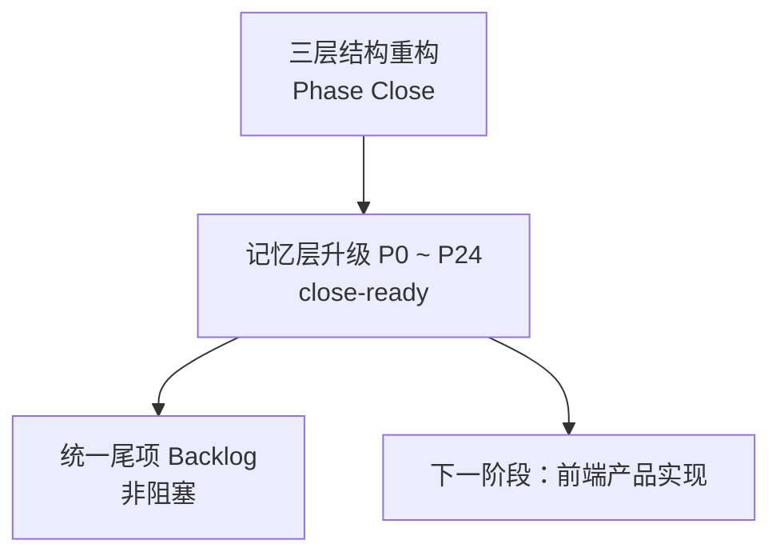
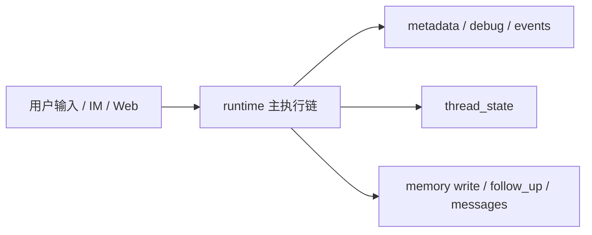
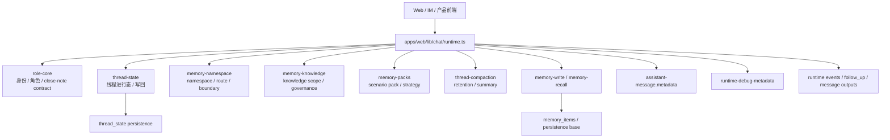
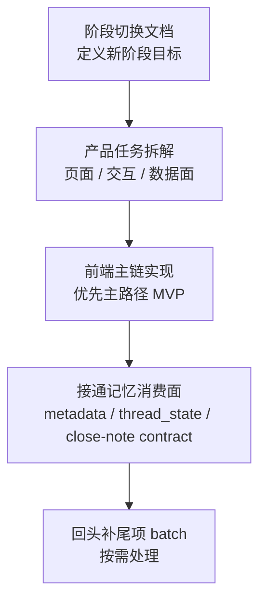

# SparkCore 项目结构与阶段总结 v1.0

## 1. 文档定位

本文档用于在以下两轮大工作完成后，给出一份可交接、可扩展、可用于下一阶段产品实现的项目现状总结：

- `SparkCore_三层重构收官说明_v0.1.md`
- `Memory Upgrade P0 ~ P24`

本文档重点回答四件事：

1. 当前项目主结构已经稳定成什么样
2. 三层结构重构到底收口了什么
3. 记忆层升级到底新增了什么能力
4. 下一阶段进入前端产品实现前，当前还缺不缺前置阻塞项

---

## 2. 当前总判断

当前项目可按下面的工程状态理解：

- 三层结构重构：已 `Phase Close`
- 记忆层升级：`P0 ~ P24` 已全部 `close-ready / 可收官`
- 升级尾项：已统一归档到 backlog，不再构成主线阻塞
- 当前阶段位置：**可以从“基础能力建设阶段”切入“产品实现阶段”**

这意味着：

- 不需要再把“记忆层升级未完成”当作前置问题
- 也不建议继续以 `P25` 的方式沿原升级主线硬往后推
- 更合适的是切换到新的产品实现阶段

---

## 3. 两轮工作的关系

可把这两轮工作理解成：

- 第一轮解决“项目主干能不能稳定承载复杂能力”
- 第二轮解决“记忆系统能不能成为长期状态内核”
- 现在第三轮才应该进入“产品体验和业务闭环真正落地”

---

## 4. 三层结构重构完成了什么

三层结构重构的正式收官结论以 [SparkCore_三层重构收官说明_v0.1.md](/Users/caoq/git/sparkcore/doc_private/SparkCore_三层重构收官说明_v0.1.md) 为准。

它收口的核心不是“代码更整齐了”，而是把几个关键基础边界钉死了：

- `runtime` 主入口与主执行链稳定
- Web / IM 接入统一 runtime 主路径
- `thread_state` 从设计概念升级为正式事实层
- `assistant_message.metadata`、`runtime_events`、`debug_metadata` 的落点稳定
- `memory_items`、`messages`、`follow_up` 等高频读写路径完成一轮收口

可以把三层结构理解成下面这个稳定骨架：

三层重构的最大价值是：

- 后续复杂能力不再需要“另起一条旁路”
- 新能力可以直接挂到现有 runtime 与状态链路上

---

## 5. 记忆层升级完成了什么

记忆层升级的正式执行基线以 [memory_upgrade_execution_plan_v1.0.md](/Users/caoq/git/sparkcore/docs/engineering/memory_upgrade_execution_plan_v1.0.md) 为准，阶段总览以 [current_phase_progress_summary_v1.0.md](/Users/caoq/git/sparkcore/docs/engineering/current_phase_progress_summary_v1.0.md) 为准。

从 `P0` 到 `P24`，这轮升级本质上完成了三件事：

### 5.1 把记忆从“若干局部能力”升级成“长期状态系统”

当前系统不再只是：

- 有 `memory_items`
- 有 `thread_state`
- 能召回一点 profile / relationship / episode / timeline

而是已经形成：

- namespace
- retention
- knowledge governance
- scenario pack
- role-core close-note chain

这些能力之间的明确协同。

### 5.2 把状态抽象逐层收成稳定 contract

后半段 `P17 ~ P24` 其实完成了一条很清晰的 close-note / persistence 收束链：

这条链现在已经全部进入：

- `role-core`
- `runtime main path`
- `system prompt`
- `assistant metadata`
- `developer diagnostics`
- `runtime debug`
- `memory-upgrade-harness`

### 5.3 把回归面做成正式 gate

`P13 ~ P24` 后半段已经不是“功能先做，测试以后再说”，而是每个阶段都形成了：

- `execution plan`
- `gate snapshot`
- `close-readiness`
- `close note`

所以当前系统不是“功能成立但边界模糊”，而是“功能成立且阶段边界已经文档化”。

---

## 6. 当前项目结构图

从当前工程角度，可以用下面这张结构图理解主骨架：

这张图里最重要的现实是：

- `runtime.ts` 仍然是总装配主链
- `role-core.ts` 现在已经成为高阶状态 contract 的集中落点
- `memory-*` 各模块已经不是零散 helper，而是分工稳定的治理层

---

## 7. 当前实际能力边界

如果从“现在这个项目已经能做什么”来看，可以把能力分成四层：

### 7.1 Runtime 层

- 统一接入 Web / IM
- 统一组装 prompt
- 统一注入记忆、知识、线程状态、scenario pack
- 统一输出 metadata / debug / events

### 7.2 State 层

- `thread_state` 是正式事实层
- `memory_items` 是当前长期存储兼容底座
- 长期状态已具备 namespace / retention / knowledge / scenario 四个主要治理面

### 7.3 Governance 层

- namespace boundary / route / write escalation
- retention lifecycle / keep-drop
- knowledge scope / governance class
- scenario strategy / orchestration

### 7.4 Close-note / Persistence Contract 层

- handoff packet
- artifact
- output
- record
- archive
- persistence payload
- persistence envelope
- persistence manifest

这一层的意义是：  
系统已经不只“能记住”，而是已经能把记忆治理结果收成高阶、可消费、可观测的结构化对象。

---

## 8. 尾项是否需要现在解决

结论很明确：

- **需要被记录和管理**
- **但不需要在进入下一阶段前先全部解决**

当前统一尾项文档是 [memory_upgrade_tail_cleanup_backlog_v1.0.md](/Users/caoq/git/sparkcore/docs/engineering/memory_upgrade_tail_cleanup_backlog_v1.0.md)。

这些尾项的性质已经被明确分类为：

- 清洁度 / 对称性尾项
- 深化型尾项
- gate 增强型尾项

它们当前的影响是：

- 不阻塞下一阶段产品实现
- 但会影响后续维护成本和回归强度

所以更合理的处理方式不是“现在先补完再说”，而是：

- 进入新阶段主线
- 同时把尾项留给后续 batch

建议的处理方式仍然是文档里已经给出的三种：

- `tail cleanup batch`
- `gate strengthening batch`
- `deepening batch`

---

## 9. 前端产品实现前，是否还有前置阻塞项

我的评估是：

- **没有必须先完成的升级侧前置阻塞项**
- **可以开始拆解前端产品实现任务**

但在真正进入开发前，仍建议先补一个很轻量的衔接动作：

### 9.1 建议做，但不算阻塞

建议先有一份“下一阶段执行文档”，把下面三件事讲清楚：

- 这次产品实现阶段的目标是什么
- 哪些现有记忆能力会被前端直接消费
- 哪些升级尾项明确不进入本阶段主线

这个动作的价值是切边界，不是补基础能力。

### 9.2 当前不建议做的事

当前不建议在前端实现前再去做：

- `P25` 式的继续升级编号
- 再造一层新的 persistence / close-note 抽象
- 回头把 backlog 全部清掉

因为这会重新模糊“升级阶段已完成”的边界。

---

## 10. 对下一阶段的建议

下一阶段如果是“前端产品具体实现”，我建议按下面顺序推进：

最合理的下一步不是继续升级记忆层，而是：

- 开一份新的产品实现阶段执行文档
- 以当前稳定结构为基础，开始拆页面、拆流程、拆交互和真实消费面

---

## 11. 一句话结论

**三层结构重构解决了“主干能否稳定承载能力”的问题；记忆层升级解决了“长期状态系统能否成为项目内核”的问题。到 `P24` 为止，这两轮基础工程已经完成，当前项目已经具备正式进入前端产品实现阶段的条件。**
