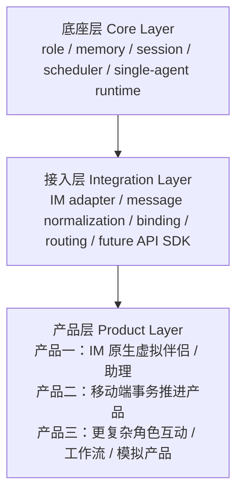
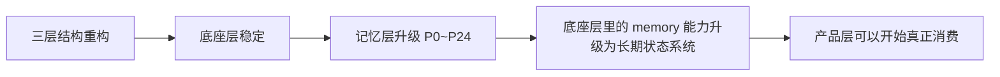
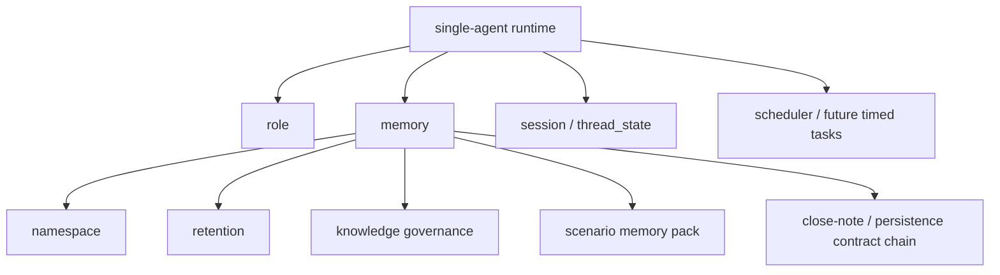
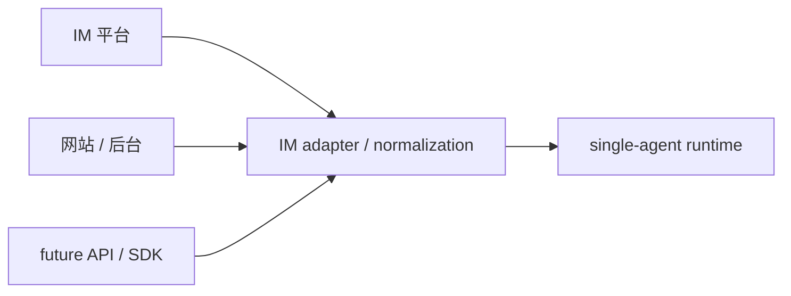
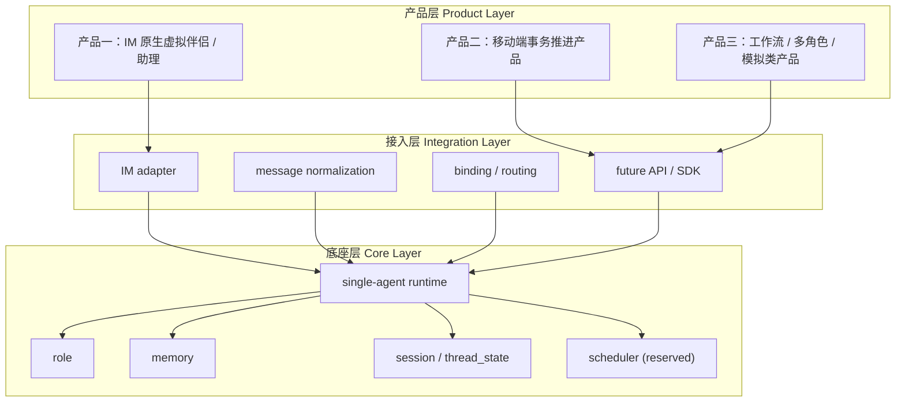

# SparkCore 项目结构与阶段总结 v1.0

## 1. 文档定位

本文档用于在以下两轮大工作完成后，给出一份更贴近 SparkCore 原始战略意图的项目现状总结：

- `SparkCore_三层重构收官说明_v0.1.md`
- `Memory Upgrade P0 ~ P24`

这份文档不是单纯的代码模块清单，而是要回答：

1. SparkCore 当前到底是什么结构
2. 三层结构重构到底重构了什么“层”
3. 记忆层升级在这三层结构里处于什么位置
4. 当前第一阶段产品与未来产品扩展应如何理解

---

## 2. 先给结论

你现在的理解，整体上是**对的**，而且比我上一版总结更接近 SparkCore 的原始架构意图。

更准确地说，当前 SparkCore 应该这样理解：

- **底座层（Core Layer）**：提供可复用、可演化、可支撑多个产品形态的能力基底
- **接入层（Integration Layer）**：把不同入口或外部渠道接到统一底座上
- **产品层（Product Layer）**：在底座层与接入层之上，构建面向用户的具体产品

其中：

- 记忆层升级主要发生在**底座层**
- IM 当前属于**接入层 + 第一阶段产品壳的重要组成部分**
- 当前第一个产品是**IM 原生的虚拟伴侣 / 助理产品**
- 后续完全可以在同一底座上继续长出产品二、产品三

所以如果用一句话总结现在的项目状态：

> **SparkCore 当前已经完成“底座层稳定化 + 记忆核心能力升级”，现在可以进入“基于这套底座去实现第一阶段产品”的阶段。**

---

## 3. 当前项目的正确三层结构

这三层不是“为了看起来整齐”的抽象，而是项目未来可扩展性的核心。

---

## 4. 三层结构重构，真正完成了什么

正式收官结论以 [SparkCore_三层重构收官说明_v0.1.md](/Users/caoq/git/sparkcore/doc_private/SparkCore_三层重构收官说明_v0.1.md) 为准。

但如果放在这套三层结构里看，三层重构的真正成果不是某几个 helper 被整理了，而是：

### 4.1 把底座层从“混在一起的项目骨架”收成真正可承载能力的 Core

当前已经被收平的底座事实包括：

- `runtime` 主执行链稳定
- `thread_state` 成为正式事实层
- `memory_items` 成为当前可工作的长期记忆兼容底座
- `assistant_message.metadata`、`debug_metadata`、`runtime_events` 有稳定注入点
- `messages`、`follow_up`、会话链路等高频路径完成一轮收口

也就是说，底座层已经不再只是“项目里的一些模块”，而是开始形成：

- 统一运行时
- 统一状态落点
- 统一调试与观测接口

### 4.2 把接入层从“产品里顺手接一下”收成统一入口思路

当前虽然最主要的接入还是 Web / IM，但经过三层重构以后，项目已经不再是“产品页面直接缠住底层逻辑”，而是更接近：

- 外部入口
- 统一 runtime
- 统一输出面

这意味着未来要增加：

- 新 IM 平台
- API 接入
- SDK 接入

时，不需要重新发明底层逻辑。

### 4.3 把产品层从“和底层缠死”拉回到可替换、可扩展的位置

这一点很关键。

三层结构重构真正为后面留下的空间是：

- 第一阶段可以先做 IM 原生虚拟伴侣 / 助理
- 第二阶段可以继续长出移动端事务推进产品
- 后面还可以做工作流型、多角色型、模拟型产品

而不需要每做一个新产品就重写底座。

---

## 5. 记忆层升级在三层结构里属于哪里

记忆层升级的正式执行基线以 [memory_upgrade_execution_plan_v1.0.md](/Users/caoq/git/sparkcore/docs/engineering/memory_upgrade_execution_plan_v1.0.md) 为准，阶段总览以 [current_phase_progress_summary_v1.0.md](/Users/caoq/git/sparkcore/docs/engineering/current_phase_progress_summary_v1.0.md) 为准。

如果按三层结构来理解，这轮 `P0 ~ P24` 的记忆层升级，本质上是：

- **不是在做某个单一产品功能**
- **不是在做 IM 产品页面**
- **而是在升级底座层里最核心的 memory 能力模块**

也就是说：

- 三层结构重构先把“底座层能不能承载复杂能力”解决了
- 记忆层升级再把“底座层里的 memory 能力是否足够成为长期状态系统”解决了

所以它在全项目里的位置应该理解成：

---

## 6. 当前底座层，已经稳定成什么样

当前的底座层不应再理解为“一个聊天项目后端”，而应理解为：

> **一个单 Agent 为主、具备长期状态能力、后续可扩展多产品与多接入形态的能力底座。**

当前底座层的关键组成，可以按下面这张图理解：

### 6.1 role

负责：

- 角色定义
- 角色身份边界
- 风格与一致性
- 长期人格连续性

### 6.2 memory

这是这轮升级的核心。

它现在已经不只是“存点记忆”，而是具备：

- namespace
- retention lifecycle
- knowledge governance
- scenario pack
- close-note / persistence contract chain

这些结构化治理能力。

### 6.3 session

核心就是：

- `thread_state`
- 当前线程目标
- 当前进行态
- 线程内约束与连续性

这部分对未来不只是陪伴产品，对事务推进产品也很关键。

### 6.4 scheduler

这块当前还不是重实现区，但架构位置已经明确保留了。

它未来会承接：

- 定时提醒
- 回流任务
- 事务推进节奏

所以当前虽然不是重点实现对象，但已经属于底座层设计的一部分。

### 6.5 single-agent runtime

当前阶段底座主线明确是：

- 单 Agent 优先
- 多 Agent 不作为当前第一阶段主交付

所以 runtime 当前应被理解为：

- 底座层的主装配器
- role / memory / session 的统一运行时

而不是单纯的“聊天逻辑函数”。

---

## 7. 当前接入层，应该怎么理解

接入层当前最重要的不是“已经有多少个平台”，而是**边界已经被立出来了**。

按照目前项目定位，接入层应包含：

- `IM adapter`
- `message normalization`
- `binding`
- `routing`
- 未来的 `API / SDK` 接入位

也就是说，IM 现在虽然是第一阶段最重要的入口，但它不等于 SparkCore 本身。

更准确的关系是：

所以你的理解是对的：

- 现在的 IM 接入属于接入层的重要部分
- 将来的 API / SDK，也更应该被理解成接入层扩展，而不是另造一套底座

---

## 8. 当前产品层，应该怎么理解

产品层不是底座的一部分，而是：

- 在底座层能力之上
- 通过接入层接触用户
- 用具体产品形态去验证价值

按照当前路线，产品层可这样理解：

### 8.1 产品一：IM 原生虚拟伴侣 / 助理

当前第一个产品的正式方向，与 [companion_mvp_flow_v1.0.md](/Users/caoq/git/sparkcore/docs/product/companion_mvp_flow_v1.0.md) 和 [sparkcore_repositioning_v1.0.md](/Users/caoq/git/sparkcore/docs/strategy/sparkcore_repositioning_v1.0.md) 一致：

- 用户通过网站完成角色配置与领取
- 用户主要在 IM 中持续互动
- 核心验证的是：
  - 角色连续性
  - 长记忆体验
  - IM 高频入口
  - 关系感与复访

### 8.2 产品二：移动端事务推进产品

这一层不是现在就做，但从架构上已经兼容：

- thread state
- 长期状态
- 提醒与调度
- 项目/任务推进

### 8.3 产品三及以后：工作流 / 多角色 / 模拟类产品

这一层当前不进入交付，但三层结构与底座能力设计已经是在为它预留空间。

---

## 9. 当前项目的真实结构图

把战略结构和工程结构合在一起，可以用下面这张图理解现在的项目：

---

## 10. 当前升级尾项是否需要先解决

结论仍然明确：

- **需要被记录和管理**
- **但不需要在进入产品阶段前先补完**

当前统一尾项文档是 [memory_upgrade_tail_cleanup_backlog_v1.0.md](/Users/caoq/git/sparkcore/docs/engineering/memory_upgrade_tail_cleanup_backlog_v1.0.md)。

这些尾项现在已经被明确归类为：

- 清洁度 / 对称性尾项
- 深化型尾项
- gate 增强型尾项

所以它们对项目的意义是：

- 不阻塞产品层启动
- 但后面仍值得按 batch 处理

也就是说，**这些尾项现在属于“治理工作”，不属于“前端产品阶段前的基础阻塞”**。

---

## 11. 对下一阶段的评估

基于当前三层结构和记忆层升级状态，我的评估是：

- **底座层：已足够稳定**
- **接入层：已有明确边界，IM 主入口已成立**
- **产品层：可以开始正式拆解与实现**

所以当前最合理的下一步不是继续做 `P25`，而是：

- 切换到产品层实施阶段
- 以“产品一：IM 原生虚拟伴侣 / 助理”为主线开始任务拆解

但在真正开始页面与交互前，我仍建议补一个很轻量的动作：

- 写一份“前端产品实现阶段执行文档”

这份文档的作用不是补底层，而是把下面三件事讲清楚：

1. 当前产品层主目标是什么
2. 底座层哪些能力是现成可消费的
3. 接入层与产品层边界如何分工

---

## 12. 一句话结论

**SparkCore 当前已经完成了从“底座层未收平”到“底座层稳定、记忆模块升级完成”的阶段跃迁。现在项目的正确理解方式，不是“继续做升级”，而是“在底座层 + 接入层已经成立的前提下，开始实现第一个产品层产品：IM 原生虚拟伴侣 / 助理”。**
