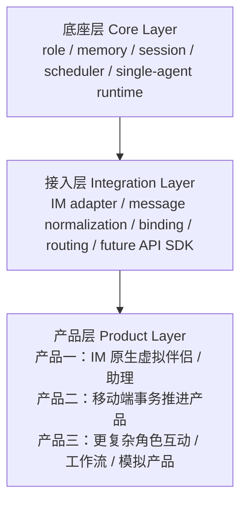
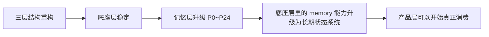
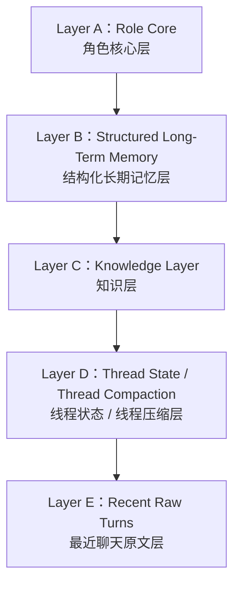
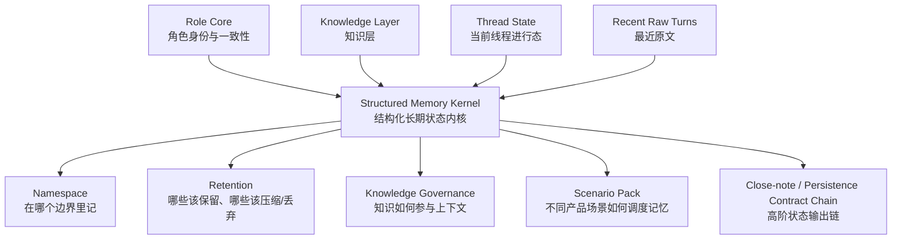
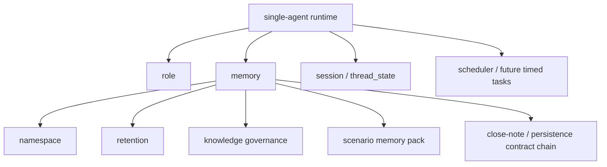
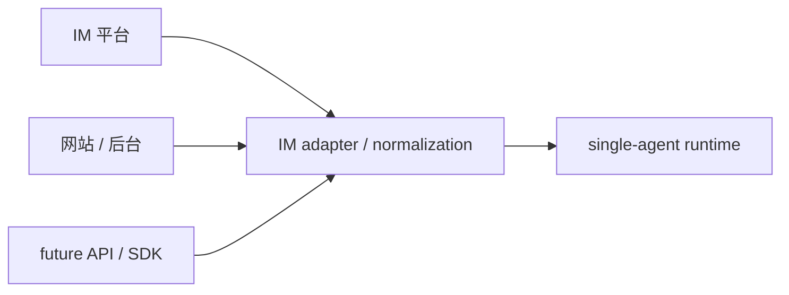
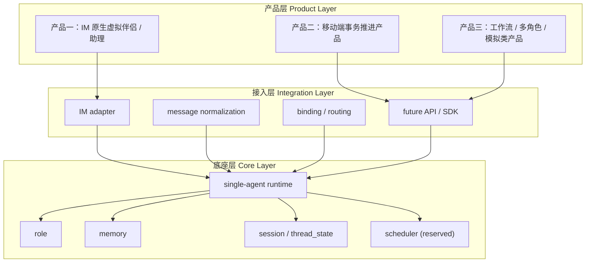

# SparkCore 项目结构与阶段总结 v1.0

## 1. 文档定位

本文档用于在以下两轮大工作完成后，给出一份更贴近 SparkCore 原始战略意图的项目现状总结：

- `SparkCore_三层重构收官说明_v0.1.md`
- `Memory Upgrade P0 ~ P24`

这份文档不是单纯的代码模块清单，而是要回答：

1. SparkCore 当前到底是什么结构
2. 三层结构重构到底重构了什么“层”
3. 记忆层升级在这三层结构里处于什么位置
4. 当前第一阶段产品与未来产品扩展应如何理解

---

## 2. 先给结论

你现在的理解，整体上是**对的**，而且比我上一版总结更接近 SparkCore 的原始架构意图。

更准确地说，当前 SparkCore 应该这样理解：

- **底座层（Core Layer）**：提供可复用、可演化、可支撑多个产品形态的能力基底
- **接入层（Integration Layer）**：把不同入口或外部渠道接到统一底座上
- **产品层（Product Layer）**：在底座层与接入层之上，构建面向用户的具体产品

其中：

- 记忆层升级主要发生在**底座层**
- IM 当前属于**接入层 + 第一阶段产品壳的重要组成部分**
- 当前第一个产品是**IM 原生的虚拟伴侣 / 助理产品**
- 后续完全可以在同一底座上继续长出产品二、产品三

所以如果用一句话总结现在的项目状态：

> **SparkCore 当前已经完成“底座层稳定化 + 记忆核心能力升级”，现在可以进入“基于这套底座去实现第一阶段产品”的阶段。**

---

## 3. 当前项目的正确三层结构

这三层不是“为了看起来整齐”的抽象，而是项目未来可扩展性的核心。

---

## 4. 三层结构重构，真正完成了什么

正式收官结论以 [SparkCore_三层重构收官说明_v0.1.md](/Users/caoq/git/sparkcore/doc_private/SparkCore_三层重构收官说明_v0.1.md) 为准。

但如果放在这套三层结构里看，三层重构的真正成果不是某几个 helper 被整理了，而是：

### 4.1 把底座层从“混在一起的项目骨架”收成真正可承载能力的 Core

当前已经被收平的底座事实包括：

- `runtime` 主执行链稳定
- `thread_state` 成为正式事实层
- `memory_items` 成为当前可工作的长期记忆兼容底座
- `assistant_message.metadata`、`debug_metadata`、`runtime_events` 有稳定注入点
- `messages`、`follow_up`、会话链路等高频路径完成一轮收口

也就是说，底座层已经不再只是“项目里的一些模块”，而是开始形成：

- 统一运行时
- 统一状态落点
- 统一调试与观测接口

### 4.2 把接入层从“产品里顺手接一下”收成统一入口思路

当前虽然最主要的接入还是 Web / IM，但经过三层重构以后，项目已经不再是“产品页面直接缠住底层逻辑”，而是更接近：

- 外部入口
- 统一 runtime
- 统一输出面

这意味着未来要增加：

- 新 IM 平台
- API 接入
- SDK 接入

时，不需要重新发明底层逻辑。

### 4.3 把产品层从“和底层缠死”拉回到可替换、可扩展的位置

这一点很关键。

三层结构重构真正为后面留下的空间是：

- 第一阶段可以先做 IM 原生虚拟伴侣 / 助理
- 第二阶段可以继续长出移动端事务推进产品
- 后面还可以做工作流型、多角色型、模拟型产品

而不需要每做一个新产品就重写底座。

---

## 5. 记忆层升级在三层结构里属于哪里

记忆层升级的正式执行基线以 [memory_upgrade_execution_plan_v1.0.md](/Users/caoq/git/sparkcore/docs/engineering/memory_upgrade_execution_plan_v1.0.md) 为准，阶段总览以 [current_phase_progress_summary_v1.0.md](/Users/caoq/git/sparkcore/docs/engineering/current_phase_progress_summary_v1.0.md) 为准。

如果按三层结构来理解，这轮 `P0 ~ P24` 的记忆层升级，本质上是：

- **不是在做某个单一产品功能**
- **不是在做 IM 产品页面**
- **而是在升级底座层里最核心的 memory 能力模块**

也就是说：

- 三层结构重构先把“底座层能不能承载复杂能力”解决了
- 记忆层升级再把“底座层里的 memory 能力是否足够成为长期状态系统”解决了

所以它在全项目里的位置应该理解成：

---

## 6. 升级前的记忆层，原始设计是什么

这一点你提得很关键。

在升级前，SparkCore 的记忆层并不是“完全没有结构”，而是已经有一套比较明确的**五层记忆视角**。这个出处在 [SparkCore_记忆层升级方案_v0.1.md](/Users/caoq/git/sparkcore/doc_private/SparkCore_记忆层升级方案_v0.1.md) 和 [SparkCore_记忆层升级方案_v0.2.md](/Users/caoq/git/sparkcore/doc_private/SparkCore_记忆层升级方案_v0.2.md) 里都能对上。

用通俗的话说，升级前的记忆层是把“一个智能体要用到的上下文”分成五层：

### 6.1 角色核心层 Role Core

这层回答的是：

- “它是不是同一个角色”
- “它的人设和说话边界还在不在”

它更像角色的“人格底板”，变化最慢。

### 6.2 结构化长期记忆层 Structured Long-Term Memory

这层回答的是：

- “长期记住了什么”
- “用户偏好、重要事实、历史事件、关系变化、约束、反馈这些东西沉淀到哪里”

它不是聊天原文仓库，而是长期状态沉淀区。

### 6.3 知识层 Knowledge Layer

这层回答的是：

- “系统知道哪些外部知识、项目知识、世界知识”

它和长期记忆不是一回事。  
长期记忆更像“互动后沉淀出来的状态”，知识层更像“外部资料和外部事实”。

### 6.4 线程状态层 Thread State / Thread Compaction

这层回答的是：

- “当前正在做什么”
- “这轮对话进行到哪里”
- “这一段长对话已经被压缩成什么摘要”

它不该和长期记忆混在一起，因为“当前进行态”和“长期稳定事实”不是一类东西。

### 6.5 最近聊天原文层 Recent Raw Turns

这层回答的是：

- “最近几轮具体说了什么”

它保留高保真原文，用来避免细节过早丢失。

---

## 7. 升级后的记忆层，实际变成了什么

升级后的记忆层，并不是把这五层推翻了，而是把它们**工程化、治理化、可观测化**了。

如果用一句最通俗的话总结：

> **升级前是“五层记忆理念”，升级后是“一个真正可运行的长期状态系统”。**

现在的记忆层不再只是“分五层看看”，而是已经长成下面这套实际结构：

也就是说，升级后的变化不是又多了几层，而是多了几种**治理能力**：

- `namespace`
- `retention`
- `knowledge governance`
- `scenario pack`
- `close-note / persistence contract chain`

这些能力让原本的五层不再只是“概念分层”，而是变成“可被系统稳定调度的结构”。

---

## 8. 用通俗语言解释：升级后每一层现在怎么工作

### 8.1 角色核心层，现在更像“角色身份底板”

现在它不只是角色配置，而是开始负责：

- 角色是不是同一个角色
- 角色说话方式是否稳定
- 长期关系感是否连续

也就是说，它现在更像“角色的大脑边界”，而不是一组静态文案。

### 8.2 长期记忆层，现在更像“长期状态库”

这层现在不是“记住一堆聊天内容”，而是尽量把高价值信息结构化，比如：

- 用户稳定偏好
- 重要事件
- 关系变化
- 约束和反馈
- 决策结果

而且它现在已经支持：

- 更新旧结论
- 替代旧结论
- 让旧结论失效
- 把不同结论关联起来

这正是参考了 `mem0`、`supermemory`、`Letta`、`Zep/Graphiti`、`AgentCore Memory` 这些产品之后，吸收出来的更成熟方向。

### 8.3 知识层，现在明确和“记忆”分开

以前很容易混淆：

- 用户聊过的东西
- 外部文档知识

升级后这一点更清楚了：

- 记忆：是互动后形成的状态
- 知识：是外部世界、项目材料、参考资料

这会让后面产品层更容易做到：

- 记得住用户
- 同时又能引用外部知识
- 两者不互相污染

### 8.4 线程状态层，现在是正式一级层

这是这轮升级里非常关键的一点。

以前很多系统会把“当前正在做什么”直接混进长期记忆里，结果就是：

- 短期任务污染长期人格
- 当前上下文和长期状态混在一起
- 用久了系统越来越乱

现在 SparkCore 已经把 `Thread State` 明确独立出来，它专门负责：

- 当前线程目标
- 当前未完成事项
- 当前约束
- 最近几轮的进行态摘要

所以未来不管是陪伴产品还是事务推进产品，这一层都会非常重要。

### 8.5 最近原文层，现在是“高保真缓冲区”

这层依然存在，而且很有必要。

因为如果一上来就把所有对话都压缩，很多细节会丢。  
所以最近几轮原文仍然保留，但它更像：

- 临时缓冲区
- 高保真窗口

而不是长期真相。

---

## 9. 升级后的记忆层，参考外部产品后新增了哪些关键能力

这次升级参考外部产品后，并不是照搬它们，而是吸收了几类关键思路。

### 9.1 从 Mem0 / Supermemory 吸收的

- 不是“把所有东西都丢进向量库”
- 而是优先做结构化用户画像、偏好、长期状态
- 强调更新、覆盖、演化，而不是只会追加

### 9.2 从 Letta 吸收的

- 把记忆看成 stateful runtime 的一部分
- 不只是检索模块，而是运行时状态的一部分

### 9.3 从 Zep / Graphiti 吸收的

- 时间语义
- 事实更新和失效
- 轻图关系
- context engineering / context assembly 的思路

### 9.4 从 AgentCore Memory 吸收的

- `namespace`
- `session / actor` 组织方式
- memory 的治理和观测思路

所以升级后的 SparkCore 记忆层，最重要的变化不是“多了几个字段”，而是它开始具备：

- 更稳定的边界
- 更明确的状态分工
- 更成熟的治理能力
- 更适合未来产品扩展的结构

---

## 10. 升级后的记忆层，支持未来怎样的拓展

现在这套结构不是只服务当前一个产品，它已经明显在为未来拓展预留空间。

### 10.1 支持产品一：IM 原生虚拟伴侣 / 助理

这一点已经最直接了：

- 角色连续性
- 长记忆关系感
- IM 高频互动

都已经有底层支撑。

### 10.2 支持产品二：移动端事务推进产品

这一点主要依赖：

- `thread_state`
- `retention`
- `scheduler` 预留位
- 长期状态与当前进行态分离

所以未来做事务推进，不需要重做一套状态系统。

### 10.3 支持未来 API / SDK

因为现在的记忆层已经有：

- 语义分层
- namespace
- 可结构化输出
- 可治理 contract

这意味着未来它更容易被包装成：

- API 能力
- SDK 能力
- 外部后端可替换能力

### 10.4 支持未来多产品并存

这也是你最关心的一点。

现在的底座层 memory 已经不再被“第一阶段产品”绑死，所以未来完全可以：

- 保留当前虚拟伴侣产品
- 在同一底座上继续长出产品二
- 再继续长出产品三

必要时可以调整记忆结构细节，但不需要推翻整套底座。

---

## 11. 当前是否支持上下文自动压缩

结论是：

- **支持**
- 而且这不是停留在草案层，而是已经进入当前设计与工程实现的正式能力

用通俗的话说，当前系统已经具备“对话太长时，自动把上下文压缩成更短但仍可继续使用的状态摘要”的能力方向，而且 `thread_state / thread_compaction / compacted summary` 已经是正式结构的一部分。

### 11.1 为什么需要自动压缩

因为对话一旦变长，如果系统永远都带着全部原文：

- 成本会越来越高
- 上下文会越来越乱
- 模型也更容易被噪音干扰

所以必须把长对话里的高价值内容抽出来，压成更短的可持续状态。

### 11.2 当前 SparkCore 的压缩逻辑放在哪

它主要放在：

- `Thread State / Thread Compaction`
- `CompactedThreadSummary`
- `retention` 治理

也就是说，压缩不是“随手做个摘要”，而是：

- 先区分什么是长期状态
- 什么是当前线程进行态
- 什么只是最近几轮原文
- 再决定哪些该保留、哪些该压缩、哪些该丢掉

### 11.3 当前这是不是“自动压缩”

从项目当前状态来说，答案可以理解为：

- **是，已经具备自动压缩逻辑的正式结构和主路径**
- 但它仍然属于后续可以继续增强的能力，不代表“压缩策略已经做到最终最优”

也就是说：

- “有没有”这个问题：**有**
- “是不是已经做到最终形态”这个问题：**还可以继续增强**

---

## 12. 当前底座层，已经稳定成什么样

当前的底座层不应再理解为“一个聊天项目后端”，而应理解为：

> **一个单 Agent 为主、具备长期状态能力、后续可扩展多产品与多接入形态的能力底座。**

当前底座层的关键组成，可以按下面这张图理解：

### 6.1 role

负责：

- 角色定义
- 角色身份边界
- 风格与一致性
- 长期人格连续性

### 6.2 memory

这是这轮升级的核心。

它现在已经不只是“存点记忆”，而是具备：

- namespace
- retention lifecycle
- knowledge governance
- scenario pack
- close-note / persistence contract chain

这些结构化治理能力。

### 6.3 session

核心就是：

- `thread_state`
- 当前线程目标
- 当前进行态
- 线程内约束与连续性

这部分对未来不只是陪伴产品，对事务推进产品也很关键。

### 6.4 scheduler

这块当前还不是重实现区，但架构位置已经明确保留了。

它未来会承接：

- 定时提醒
- 回流任务
- 事务推进节奏

所以当前虽然不是重点实现对象，但已经属于底座层设计的一部分。

### 6.5 single-agent runtime

当前阶段底座主线明确是：

- 单 Agent 优先
- 多 Agent 不作为当前第一阶段主交付

所以 runtime 当前应被理解为：

- 底座层的主装配器
- role / memory / session 的统一运行时

而不是单纯的“聊天逻辑函数”。

---

## 7. 当前接入层，应该怎么理解

接入层当前最重要的不是“已经有多少个平台”，而是**边界已经被立出来了**。

按照目前项目定位，接入层应包含：

- `IM adapter`
- `message normalization`
- `binding`
- `routing`
- 未来的 `API / SDK` 接入位

也就是说，IM 现在虽然是第一阶段最重要的入口，但它不等于 SparkCore 本身。

更准确的关系是：

所以你的理解是对的：

- 现在的 IM 接入属于接入层的重要部分
- 将来的 API / SDK，也更应该被理解成接入层扩展，而不是另造一套底座

---

## 8. 当前产品层，应该怎么理解

产品层不是底座的一部分，而是：

- 在底座层能力之上
- 通过接入层接触用户
- 用具体产品形态去验证价值

按照当前路线，产品层可这样理解：

### 8.1 产品一：IM 原生虚拟伴侣 / 助理

当前第一个产品的正式方向，与 [companion_mvp_flow_v1.0.md](/Users/caoq/git/sparkcore/docs/product/companion_mvp_flow_v1.0.md) 和 [sparkcore_repositioning_v1.0.md](/Users/caoq/git/sparkcore/docs/strategy/sparkcore_repositioning_v1.0.md) 一致：

- 用户通过网站完成角色配置与领取
- 用户主要在 IM 中持续互动
- 核心验证的是：
  - 角色连续性
  - 长记忆体验
  - IM 高频入口
  - 关系感与复访

### 8.2 产品二：移动端事务推进产品

这一层不是现在就做，但从架构上已经兼容：

- thread state
- 长期状态
- 提醒与调度
- 项目/任务推进

### 8.3 产品三及以后：工作流 / 多角色 / 模拟类产品

这一层当前不进入交付，但三层结构与底座能力设计已经是在为它预留空间。

---

## 9. 当前项目的真实结构图

把战略结构和工程结构合在一起，可以用下面这张图理解现在的项目：

---

## 10. 当前升级尾项是否需要先解决

结论仍然明确：

- **需要被记录和管理**
- **但不需要在进入产品阶段前先补完**

当前统一尾项文档是 [memory_upgrade_tail_cleanup_backlog_v1.0.md](/Users/caoq/git/sparkcore/docs/engineering/memory_upgrade_tail_cleanup_backlog_v1.0.md)。

这些尾项现在已经被明确归类为：

- 清洁度 / 对称性尾项
- 深化型尾项
- gate 增强型尾项

所以它们对项目的意义是：

- 不阻塞产品层启动
- 但后面仍值得按 batch 处理

也就是说，**这些尾项现在属于“治理工作”，不属于“前端产品阶段前的基础阻塞”**。

---

## 11. 对下一阶段的评估

基于当前三层结构和记忆层升级状态，我的评估是：

- **底座层：已足够稳定**
- **接入层：已有明确边界，IM 主入口已成立**
- **产品层：可以开始正式拆解与实现**

所以当前最合理的下一步不是继续做 `P25`，而是：

- 切换到产品层实施阶段
- 以“产品一：IM 原生虚拟伴侣 / 助理”为主线开始任务拆解

但在真正开始页面与交互前，我仍建议补一个很轻量的动作：

- 写一份“前端产品实现阶段执行文档”

这份文档的作用不是补底层，而是把下面三件事讲清楚：

1. 当前产品层主目标是什么
2. 底座层哪些能力是现成可消费的
3. 接入层与产品层边界如何分工

---

## 12. 一句话结论

**SparkCore 当前已经完成了从“底座层未收平”到“底座层稳定、记忆模块升级完成”的阶段跃迁。现在项目的正确理解方式，不是“继续做升级”，而是“在底座层 + 接入层已经成立的前提下，开始实现第一个产品层产品：IM 原生虚拟伴侣 / 助理”。**
